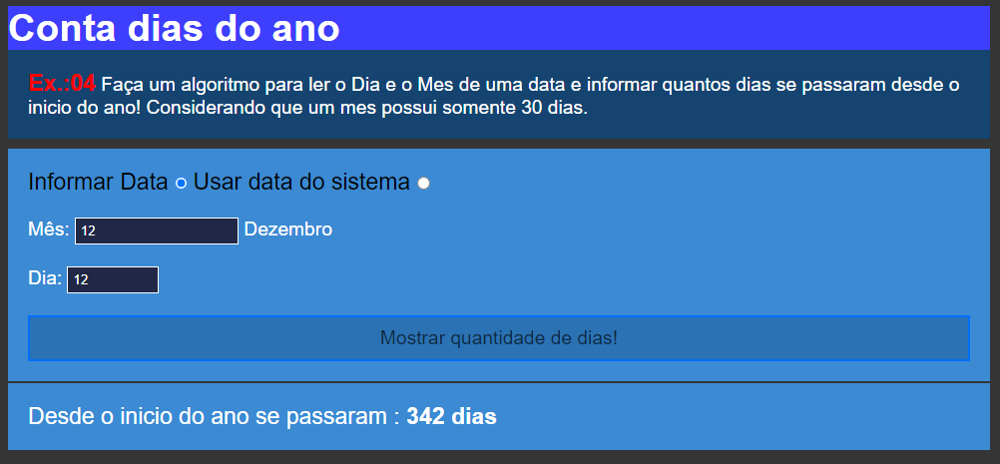

# Conta dias do ano

Criado com `Javascript` para fins de `treino` então o `Conta dias do ano` é um projeto que exibe os dias que se passaram desde o inicio do ano até uma determinada data,
o projeto começa com duas opções que são `Informar Data` e ` Usar data do sistema` a primeira opção o usuário coloca os dados manualmente ou seja o mês e o dia
clicando no botão `Mostrar quantidade de dias` o sistema vai retornar os dias que se passaram desde o inicio do ano até a data inserada,
vai retornar a seguinte mensagem `Desde o inicio do ano se passaram : X dias`. Já clicando na segunda opção ` Usar data do sistema` o sistema vai ignorar os dados inseridos pelo usuario retornando automaticamente os dias que se passaram desde o inicio do ano até a data atual do seu dispositivo `Computador ou Telefone`.

## Tecnologias

As seguintes ferramentas foram usadas para constuição deste projeto: 
- HTML
- CSS
- JAVASCRIPT
#
Feito por Pascoal Kahamba meu [Linkedin](https://www.linkedin.com/in/pascoal-kahamba-7b43bb233?lipi=urn%3Ali%3Apage%3Ad_flagship3_profile_view_base_contact_details%3BTg8LEKayToyytOX1pVAQ%2Bg%3D%3D)

[Clique aqui se deseja ver a aplicação rodando!](https://conta-diasdo-ano.vercel.app/)
